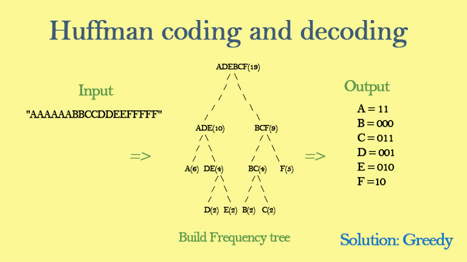

<h1 align='center'> Huffman Compressor/Decompressor</h1>
<h3 align='center'> File compressor/decompressor using a C++ Huffman coding algorithm implementation.</h3>
<p align='center'></p>

## Overview

HuffmanCompressor is a project created as part of a mini project to utilize Huffman's algorithm for data compression. This project includes both compression and decompression functionalities, providing an efficient way to manage file sizes by encoding data based on character frequencies.

## Huffman Coding Algorithm Description

Huffman's algorithm builds an optimal binary tree for compressing data based on character frequencies. The steps are as follows:

1. **Initialization**: Start with a forest of single-node trees, each representing a character and its frequency.
2. **Tree Construction**: Repeatedly combine the two trees with the smallest weights into a new tree until only one tree remains.
3. **Completion**: The final tree is used to generate unique binary codes for each character, ensuring optimal compression.

This method is highly efficient because it assigns shorter codes to more frequent characters and longer codes to less frequent characters, minimizing the overall file size.

---

## Implementation

HuffmanCompressor consists of two main components: the compression program and the decompression program. Both share essential classes, functions, and data structures to efficiently compress and decompress files.

### Main Data Structures

- **Unordered Maps**: Used for storing character-frequency pairs and character-code pairs.
- **Priority Queue**: Implements a min-heap to efficiently build the Huffman tree.

### File Header

The compressed file contains a header with the tree structure or character frequencies. This header is essential for the decompression process. Various methods can store this information, such as character counts or a pre-order traversal of the tree.

### Challenges Encountered

1. **Output Buffering**: Operating systems buffer output for efficiency, which can complicate writing bits to a file. This project ensures that all bits, including padding, are correctly managed.
2. **Padding Bits**: Files need to be multiples of certain sizes (e.g., 8 bits). Extra bits (padding) are added and handled during decompression to ensure data integrity.
3. **Pseudo EOF Character**: A unique character (out of the standard ASCII range) is used to mark the end of the compressed data, ensuring proper decompression.

---

## Getting Started

### Prerequisites

- C++11 or later
- Standard C++ libraries

### Building the Project

1. **Clone the repository**:
   ```sh
   git clone https://github.com/yourusername/HuffmanCompressor.git
   cd HuffmanCompressor
2. **Compile the source code**:
   ```sh
   g++ -o HuffmanCompressor main.cpp FrequencyCounter.cpp Huffman.cpp Node.cpp -std=c++11

### **Running the program**:
1. **Compression**:

   ```sh
   ./HuffmanCompressor

a. Enter compress when prompted.
   b. The program reads input.txt, compresses it to output.txt, and displays compression statistics.

2. **Decompression**;
  ```sh
  ./HuffmanCompressor

a. Enter decompress when prompted.
   b. The program reads output.txt, decompresses it to output2.txt, and displays decompression statistics.


